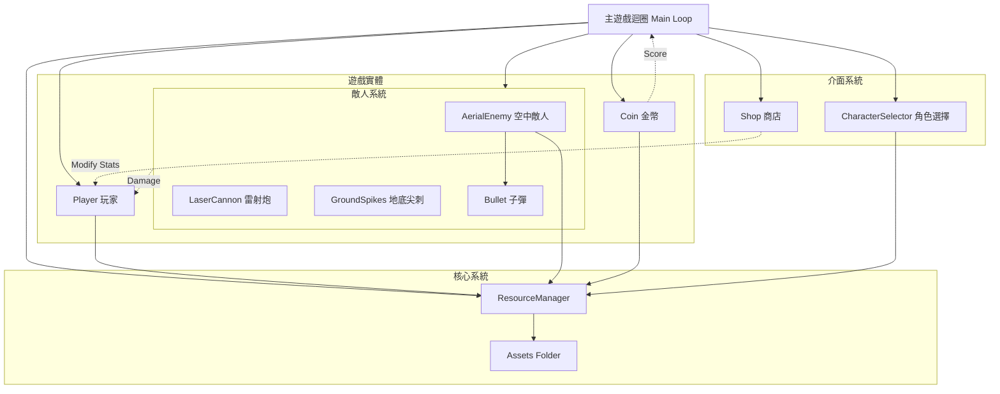

# 接金幣遊戲 (雷射特效美化版)

這是一個使用 Python 和 Pygame 開發的接金幣遊戲。玩家需要控制角色移動與跳躍，接取掉落的金幣以獲得分數，同時躲避來自空中敵人的子彈、地面的尖刺以及毀滅性的雷射炮。遊戲包含商店系統，可購買技能與道具來強化角色生存能力。

## 專案介紹

本專案是一個具備完整遊戲循環的 2D 動作遊戲。特色包含：
- **動態難度**：隨著分數增加，遊戲難度會提升（出現雷射炮、尖刺、空中敵人）。
- **商店系統**：可購買加速、高跳、護盾以及格擋技能。
- **角色進化**：收集分數可使角色外觀進化。
- **視覺特效**：包含雷射預警、發射特效、粒子效果等。

## 系統需求與安裝

本專案依賴 `pygame` 函式庫。

1. **安裝 Python 3.x**
2. **安裝入庫**：
   ```bash
   pip install pygame
   ```

## 如何執行

在終端機中執行以下指令啟動遊戲：

```bash
python 棨竣gemini.py
```

## 程式碼架構

本專案主要由 `棨竣gemini.py` 構成，並引用 `assets/` 資料夾中的圖片資源。

### 主要類別 (Classes)

*   **`ResourceManager`**: 負責載入與管理 `assets` 資料夾中的圖片資源。
*   **`Player`**: 玩家角色類別。處理移動、跳躍、技能（護盾、格擋）以及角色進化邏輯。
*   **`Coin`**: 掉落的金幣類別。包含普通金幣與懲罰金幣（扣分）。
*   **`Shop`**: 商店系統介面與邏輯。提供購買速度、跳躍力、護盾與格擋技能。
*   **`CharacterSelector`**: 遊戲開始前的角色選擇介面。
*   **敵人類別**:
    *   **`LaserCannon`**: 雷射炮系統。具有預警與發射兩階段，造成大範圍傷害。
    *   **`GroundSpikes`**: 地底尖刺系統。從地面升起攻擊玩家。
    *   **`AerialEnemy`**: 空中敵人。在頂部移動並瞄準玩家發射子彈。
    *   **`Bullet`**: 空中敵人發射的子彈。

### 引用的 Libraries

*   **`pygame`**: 遊戲核心引擎，處理圖形繪製、事件監聽與音效（如有）。
*   **`sys`**: 用於系統相關操作，如結束程式。
*   **`random`**: 用於隨機產生金幣位置、敵人攻擊時機等。
*   **`math`**: 用於計算子彈軌跡角度、特效的正弦波震動等。
*   **`os`**: 用於檔案路徑處理與讀取資源。

## 架構圖 (Mermaid)

以下是遊戲系統的簡易架構圖，展示了各個模組之間的關係：


